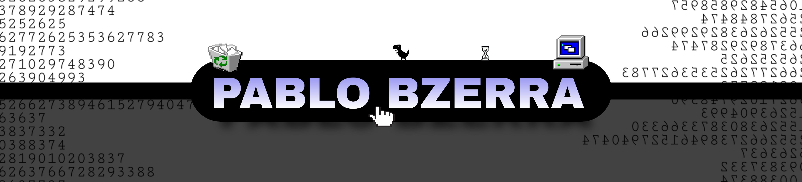

</img>

###      😊Bem Vindo ao meu perfil!!
### Linguagens
##
- Python
- Lua
- JavaScript
- Java
- Shell

### Tecnologias
- APIs
- TKinter(aprendendo a fazer o designer
- PyTelegramApiBot(Bots em GERAL)
- sqlite3
- firebase
- flask (API Restfull)

Obs: Aprendendo Java
##
E se eu não souber, eu aprendo na hora
##
Bom, não tenho muito oque colocar😅
mas quero ser um grande programador
